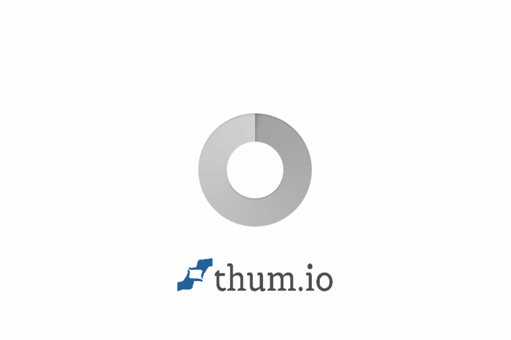
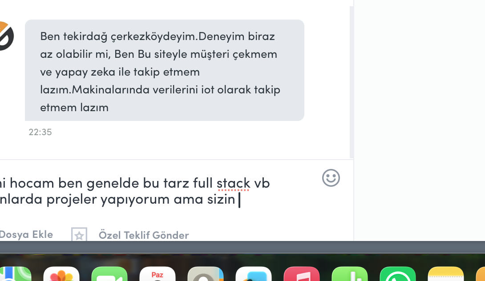

<div align="center">
  
  
  # 🚀 FileDrop: Yeni Nesil Gerçek Zamanlı Dosya Paylaşım Platformu

  **Kızlı, Güvenli ve Sınırsız Dosya Transferi!**

  [](https://reactjs.org/)
  [](https://nodejs.org/)
  [](https://socket.io/)
  [](https://www.docker.com/)

  [Özellikler](#-özellikler) • [Nasıl Çalışır?](#%EF%B8%8F-nasıl-çalışır) • [Kurulum](#%EF%B8%8F-kurulum) • [Teknolojiler](#%EF%B8%8F-kullanılan-teknolojiler)
</div>

---

## 🌟 Projenin Amacı ve Hikayesi

**FileDrop**'un ana çıkış noktası ve en büyük amacı; **kırtasiye, okul veya fotokopicilerde çıktı alırken ortak bilgisayarlara WhatsApp Web (veya mail) girişi yapma zorunluluğunu ve kişisel hesapları açık unutma riskini tamamen ortadan kaldırmaktır.**

Ortak ve güvensiz bilgisayarlara kişisel hesaplarınızı bağlamadan, QR kod ile veya 6 haneli oda koduyla saniyeler içinde geçici bir odaya girebilir, çıktı alacağınız dosyayı aktarabilir ve işiniz bittiğinde dosyalarınızla birlikte tamamen anonim bir şekilde ayrılabilirsiniz. Ayrıca büyük boyutlu dosyaları aktarırken yaşanan "boyut limiti" veya "yavaş aktarım" gibi problemleri de ortadan kaldırır.

İster kırtasiyede hızlıca bir PDF çıkartın, ister çalışma arkadaşınızla devasa boyutlu bir projeyi saniyeler içinde paylaşın. **Aynı ağa bağlı olma zorunluluğu yoktur**, sistem modern web teknolojileri sayesinde tamamen gerçek zamanlı (real-time) çalışır.

---

## 📸 Ekran Görüntüleri

*Buraya projenin çalıştığı anlara ait ekran görüntülerini ekleyebilirsiniz.*

<div align="center">
  
  
</div>

---

## ✨ Özellikler

- ⚡ **Gerçek Zamanlı (Real-Time) Senkronizasyon:** Yüklenen dosyalar anında tüm bağlı ekranlarda belirir. Sayfa yenilemeye gerek kalmaz!
- 📱 **QR Kod İle Hızlı Paylaşım:** Mobil cihazlardan kolay erişim için otomatik QR kod oluşturucu. Telefon kamerasını okutun ve hemen dosya gönderin/alın.
- 📦 **Toplu İndirme (ZIP):** Yüklenen çoklu dosyaları tek bir tıklama ile `.zip` arşivi olarak indirebilme kolaylığı.
- 🚀 **Chunked Upload (Parçalı Yükleme):** Büyük medya dosyalarını (video vb.) parçalara bölerek yükleme özelliği sayesinde sunucu/proxy boyut sınırlarına (Cloudflare vb.) takılmaz.
- 🐳 **Docker Desteği:** Tek komutla kur ve çalıştır (`docker-compose up -d`).
- 🎨 **Modern ve Responsive Tasarım:** Hem mobil hem masaüstü cihazlar için optimize edilmiş, göz yormayan şık UI.

---

## 🛠️ Kullanılan Teknolojiler

### 🖥️ Frontend (İstemci)
* **React & Vite:** Çok hızlı derleme ve akıcı kullanıcı deneyimi.
* **Socket.io-Client:** Anlık veri senkronizasyonu.
* **QRCode:** Mobil cihazların sisteme entegrasyonu.
* **Vanilla CSS:** Özelleştirilmiş, animasyonlu modern tasarım.

### ⚙️ Backend (Sunucu)
* **Node.js & Express.js:** Güçlü ve hızlı API altyapısı.
* **Socket.io:** Çift yönlü anlık iletişim katmanı.
* **Multer:** Gelişmiş dosya yükleme (Multipart/form-data) yönetimi.
* **Archiver:** Anlık olarak dosyaları sıkıştırıp `.zip` formatında sunma.

---

## ⚙️ Kurulum ve Çalıştırma

Projeyi lokalinizde veya kendi sunucunuzda ayağa kaldırmak çok kolaydır.

### Seçenek 1: Docker İle (Önerilen) 🐳

Sisteminizde `Docker` ve `Docker Compose` kuruluysa, sadece şu komutu çalıştırmanız yeterlidir:

```bash
docker-compose up -d --build
```
Uygulama `http://localhost:3001` adresinde yayına girecektir. 

### Seçenek 2: Manuel Kurulum (Geliştirici Modu) 💻

**1. Repoyu Klonlayın:**
```bash
git clone https://github.com/KULLANICI_ADINIZ/filedrop.git
cd filedrop
```

**2. Backend Kurulumu:**
```bash
cd server
npm install
npm run dev
```

**3. Frontend Kurulumu:**
Yeni bir terminal sekmesi açın:
```bash
cd client
npm install
npm run dev
```

---

## ☁️ Production (Canlı Ortam) Dağıtımı

FileDrop, **Cloudflare Tunnels** ve **VDS** yapılarına tamamen uyumludur. Büyük dosya yüklemeleri için Nginx/Cloudflare taraflı `client_max_body_size` hatalarını aşmak adına projede **"Chunked Upload"** mimarisi kullanılmıştır.

---

## 🤝 Katkıda Bulunma

1. Bu repoyu forklayın (`Fork`).
2. Özellik dalınızı oluşturun (`git checkout -b feature/YeniOzellik`).
3. Değişikliklerinizi commit'leyin (`git commit -m 'Harika bir özellik eklendi'`).
4. Dalınızı push'layın (`git push origin feature/YeniOzellik`).
5. Bir **Pull Request** açın.

---

<div align="center">
  <p><i>Sevgiyle ve ☕ ile geliştirildi.</i></p>
  
  #filedrop #reactjs #nodejs #socketio #realtime #dosyapaylasimi #docker #webdevelopment #javascript #opensource #filetransfer
</div>
